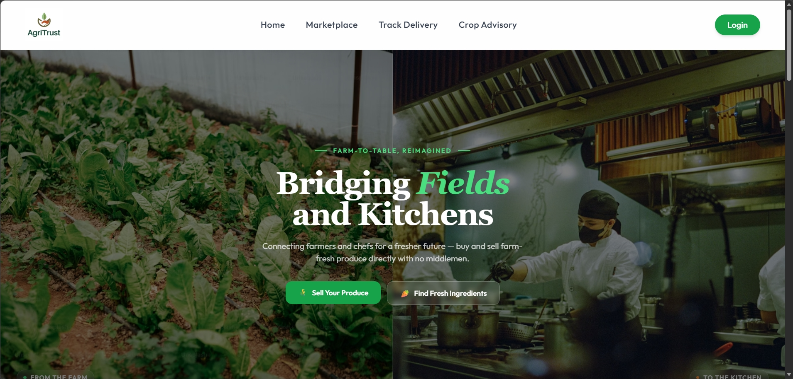
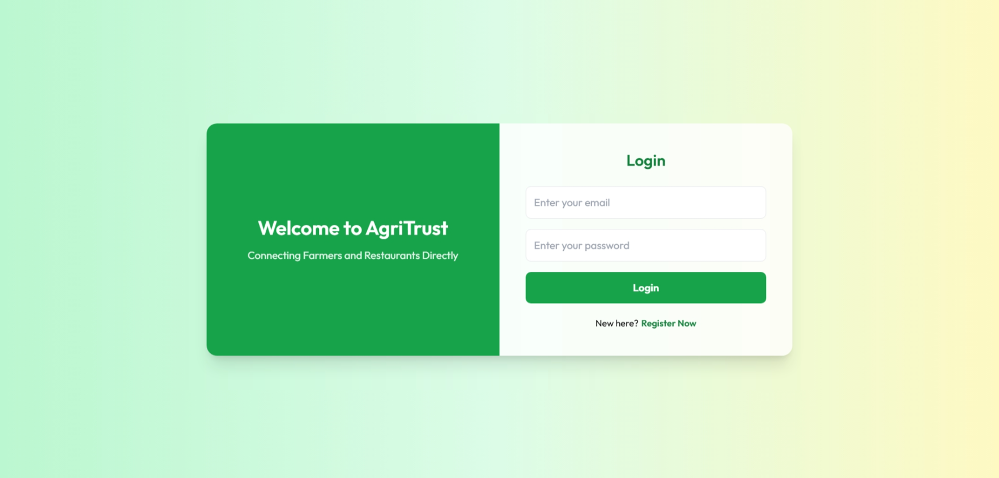
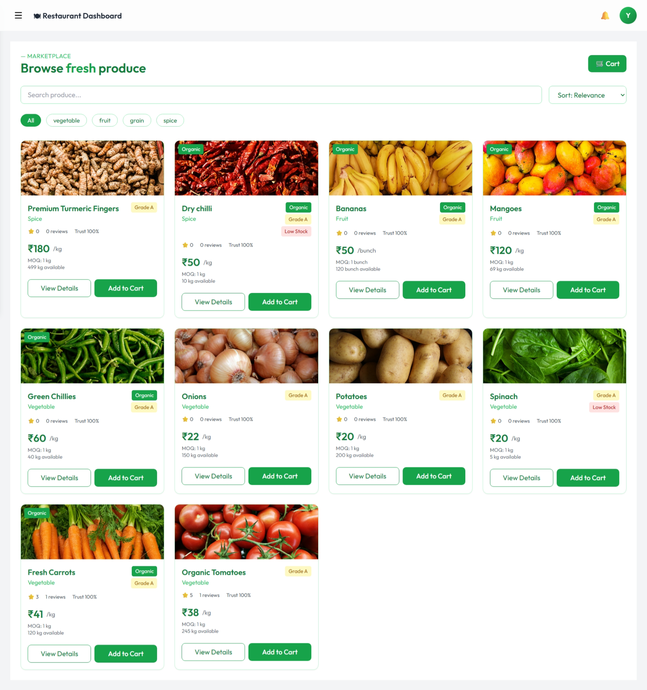
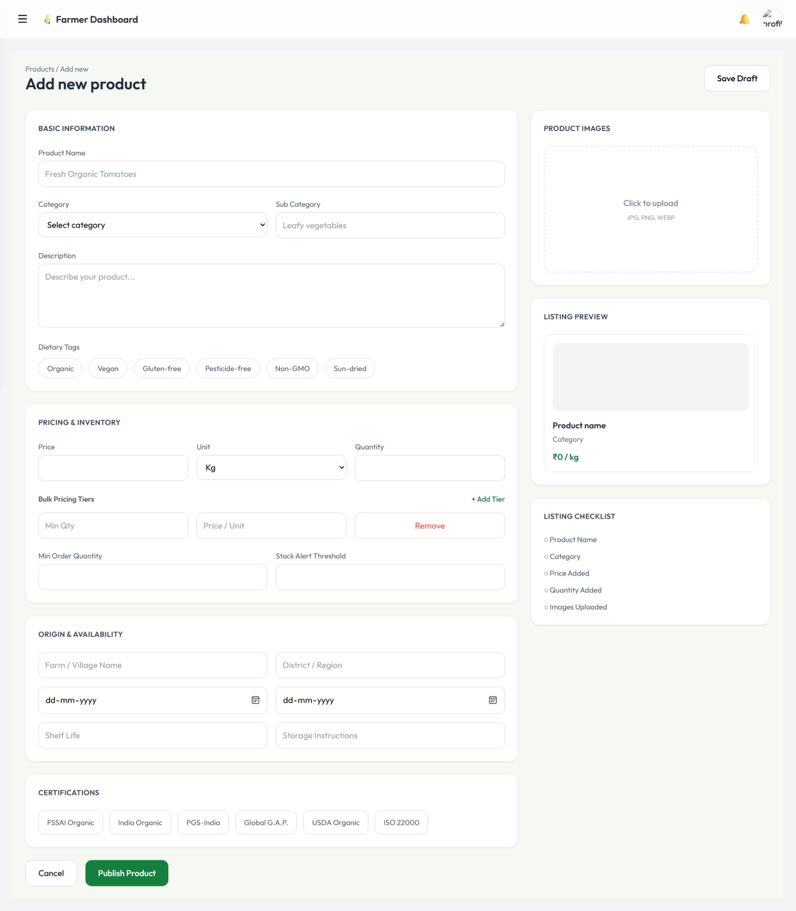

# AgriTrust – Farmer to Restaurant Marketplace

AgriTrust is a full-stack MERN marketplace platform that connects farmers directly with restaurants and bulk buyers.  
The platform helps farmers sell products without middlemen while allowing restaurants to purchase fresh produce directly from trusted sources.

---

# Features

## Farmer Features
- Farmer registration & login
- Add, edit, and delete products
- Upload product images
- Draft & publish listings
- Bulk pricing support
- Stock availability management
- View incoming orders
- Dashboard with statistics
- Profile management

## Restaurant Features
- Restaurant registration & login
- Browse farmer products
- Search & filter products
- Product details page
- Add reviews & ratings
- Place orders
- View order history
- Wishlist/Favorites support

## Authentication & Security
- JWT authentication
- Role-based authorization
- Protected routes
- Password hashing using bcrypt
- Secure API handling

## Additional Features
- Product reviews & ratings
- Save draft products
- Responsive UI
- REST API architecture
- Toast notifications
- Form validations
- Image upload with Multer

---

# Tech Stack

## Frontend
- React.js
- React Router
- Axios
- Tailwind CSS
- Framer Motion

## Backend
- Node.js
- Express.js
- MongoDB
- Mongoose
- JWT Authentication
- Multer

---


# 📸 Screenshots

## Home Page


## Farmer Dashboard


## Product Listing


## Restaurant Dashboard


---
# Project Structure

```bash
AgriTrust/
│
├── backend/
│   ├── controllers/
│   ├── middleware/
│   ├── models/
│   ├── routes/
│   ├── uploads/
│   ├── utils/
│   └── server.js
│
├── frontend/
│   ├── public/
│   ├── src/
│   │   ├── components/
│   │   ├── pages/
│   │   ├── services/
│   │   ├── context/
│   │   └── App.jsx
│   └── package.json
│
└── README.md